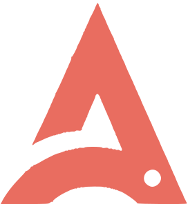

 I am Dipan, a Full Stack Developer at <a href="https://www.appliedagi.com">  <b>Applied AGI</b> </a> in 
  <b>London, England</b>. 
<h3>
   Weather in London
</h3> Currently, the weather is: <b> 16°C, <i>overcast clouds</i>
</b>
  Today, the sun rises at <b>02:38</b> and sets at <b>21:05</b>. 

<h3>
   Spotify Playing
</h3>

<h3>
   Where to find me
</h3>

  
  
  
  
  
  
  
  
  
  
  
  
  
  
  
  

 

  
 &#9655;

  <h3>
     Tech Stack
  </h3>
  
   
  

    
 &#9655;

    
    <h3>
       Trophies
    </h3>
    
     
    

    
 &#9655;

    
    <h3>
       End Credits
    </h3>
    

      
      
      
      
      
      
      
      
      
      
      
      
      
      
      
      
      
      
    

     
    

  

  
  <b> Last Refresh: </b> Wednesday, 2 July, 04:52 BST

